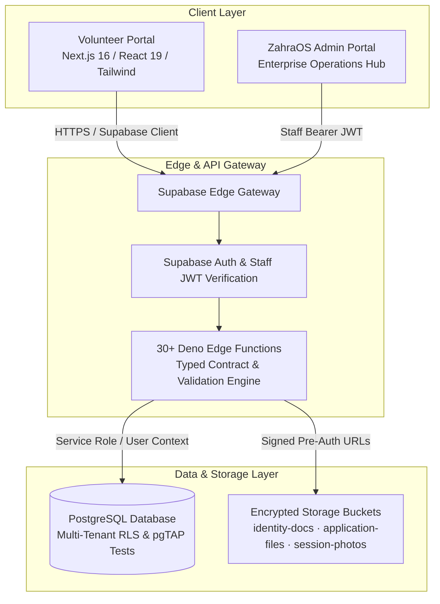

# Youth Republic (YR)

> **Decentralized Youth Civic Engagement & Verified Volunteer Ecosystem**  
> An impact-first civic platform by **The Mohsin Project Global** connecting Pakistani youth with accredited non-profits, relief drives, and community service initiatives through cryptographically verifiable volunteering credentials and privacy-preserving KYC.

[](https://nextjs.org/)
[](https://react.dev/)
[](https://supabase.com/)
[](https://deno.land/)
[](https://www.postgresql.org/)
[](https://www.typescriptlang.org/)
[](https://tailwindcss.com/)
[](https://pgtap.org/)

---

## 🌟 Executive Overview

In emerging economies, volunteering and social impact work are plagued by fragmented coordination, unverified service hours, counterfeit certificates, and substantial data privacy risks for youth. **Youth Republic** solves this by establishing a trusted, tamper-evident civic infrastructure for Pakistan's 140+ million youth population.

Developed under **The Mohsin Project Global** and piloted with relief networks such as **Rizq**, Youth Republic powers the end-to-end volunteer lifecycle:
- **Unified Lifetime Volunteer ID** (`YR-YYYY-XXXXX`) serving as a singular civic profile across partner institutions.
- **Dynamic Application Workflows**: Schema-driven custom application forms per opportunity supporting 12 field types, dynamic validation, and instant preview.
- **Privacy-Preserving KYC with Zero Document Retention**: Identity verification (CNIC/B-Form) with pre-signed ephemeral storage and immediate cryptographic purge upon review.
- **Audited Service Hours & Accredited Portfolios**: Multi-party hour logging with supervisor verification, photographic proof attachments, and downloadable verified service transcripts.

---

## 🏗 System Architecture

Youth Republic is built on a modern decoupled architecture: a high-performance **Next.js 16 (React 19)** volunteer application backed by a dedicated **Supabase Cloud (PostgreSQL + RLS)** instance with **30+ Deno Edge Functions**.

It interoperates cleanly with **ZahraOS** (the enterprise administrative command center) through an asymmetric trust boundary: ZahraOS mints signed JWTs with fine-grained capability claims, and Youth Republic verifies and enforces tenant-scoped Row Level Security.



---

## ✨ Key Features & Engineering Highlights

### 1. Unified Volunteer Digital Identity (`YR-YYYY-XXXXX`)
- Every volunteer is assigned an immutable, sequence-guaranteed identity string upon registration.
- Prevents duplicate identities across multiple campaigns and partner organizations.

### 2. Minor Safeguarding & Zero-Retention KYC
- Built strictly compliant with child protection frameworks: conditional guardian consent workflows automatically trigger for volunteers aged 13–17.
- **Zero Document Retention**: CNIC / B-Form uploads use short-lived, pre-signed upload tickets. Once an authorized compliance officer verifies identity, the raw document is permanently purged from storage, retaining only an immutable verified boolean flag.

### 3. Dynamic JSON Form Engine
- Opportunity organizers can build custom application forms with up to 12 field types:
  - `short_text`, `long_text`, `email`, `phone`, `url`, `number`, `date`
  - `select`, `multiselect`, `radio`, `checkbox`, `file`
- Client and server share a byte-identical pure TypeScript validator (`_shared/forms.ts`) ensuring deterministic validation without code duplication.

### 4. Verified Hours & Audit Trails
- Volunteers submit hours with session timestamps, task descriptions, and session photo proofs.
- Supervisors can approve, reject, or adjust hours with mandatory explanatory admin notes (`adjusted: boolean`).
- All administrative operations record immutable audit entries in `admin_action_log`.

### 5. Multi-Tenant Row Level Security (RLS)
- 29+ granular migrations defining Postgres policies that enforce strict tenant isolation.
- Cross-project staff authorization uses HS256-signed JWTs containing scoped claims (`org_roles`, `can_verify_identity`, `module_access`).

---

## 🛠 Tech Stack

| Layer | Technologies |
|---|---|
| **Frontend Web** | Next.js 16 (App Router), React 19, TypeScript, Tailwind CSS v4, SWR |
| **Typography & UI** | Oswald Display + Jost Body design language (Editorial Noticeboard direction) |
| **Backend & Runtime** | Supabase Edge Functions (Deno runtime), RESTful Edge APIs |
| **Database & Security**| PostgreSQL 15+, Row Level Security (RLS), custom PL/pgSQL triggers & constraints |
| **Storage & Media** | Private Supabase Storage Buckets (`identity-docs`, `application-files`, `session-photos`) |
| **Testing** | pgTAP (Database RLS & constraints), Deno Test Runner (Edge handlers), Vitest & React Testing Library |

---

## 📁 Repository Structure

```text
youth-republic/
├── backend/
│   ├── supabase/
│   │   ├── config.toml           # Supabase CLI configuration & function route settings
│   │   ├── functions/            # 30+ Deno Edge Functions
│   │   │   ├── _shared/          # Shared JWT verification, database clients, form schemas
│   │   │   ├── apply-to-opportunity/
│   │   │   ├── bulk-assign-hours/
│   │   │   ├── create-opportunity/
│   │   │   ├── decide-application/
│   │   │   ├── finalize-attachment/
│   │   │   ├── get-volunteer-portfolio/
│   │   │   ├── list-opportunities/
│   │   │   ├── register-volunteer/
│   │   │   ├── submit-hours/
│   │   │   ├── verify-hours/
│   │   │   └── verify-volunteer/
│   │   ├── migrations/           # 29 PostgreSQL schema & RLS migration scripts
│   │   ├── seed/                 # Seed pipelines (reset.sql, seed.ts, test fixtures)
│   │   ├── tests/                # pgTAP database tests & Edge function unit tests
│   │   └── scripts/              # Data maintenance and synthetic data cleanup
│   └── .env.example              # Backend environment template
├── frontend/
│   ├── app/                      # Next.js 16 App Router pages
│   │   ├── apply/                # Dynamic application submission
│   │   ├── login/ & register/    # 2-step registration with ID document upload
│   │   ├── opportunities/        # Noticeboard & detailed opportunity discovery
│   │   ├── portfolio/            # Verified volunteer transcript & impact timeline
│   │   └── profile/              # User settings & emergency contacts
│   ├── components/               # Accessible, production-ready React components
│   ├── lib/                      # Typed backend API client & form engine
│   ├── tests/                    # Vitest and React Testing Library specs
│   ├── package.json
│   └── vitest.config.ts
├── docs/                         # Architecture specs, build status, and gap analysis
└── README.md
```

---

## 🧪 Testing & Verification Strategy

Youth Republic adheres to a strict testing pyramid designed to ensure zero data leakage and rock-solid business logic:

1. **Database & RLS Testing (`pgTAP`)**:
   - Tests run in isolated PostgreSQL transactions (`BEGIN ... ROLLBACK`).
   - Asserts tenant isolation, unauthorized read/write denial, and constraint enforcement across all 29 migrations.
   ```bash
   for f in backend/supabase/tests/database/*.sql; do
     psql "$SUPABASE_DB_URL" -v ON_ERROR_STOP=1 -f "$f"
   done
   ```

2. **Edge Function Handler Tests (`Deno`)**:
   - Covers request validation, error formatting, IDOR guards, and idempotency across all Edge Functions.
   ```bash
   cd backend/supabase && deno task test
   ```

3. **Frontend Component & Flow Tests (`Vitest`)**:
   - Tests form rendering, dynamic field generation, validation states, and auth flows with mocked network barriers.
   ```bash
   cd frontend && npm test
   ```

---

## 🚀 Local Development Setup

### Prerequisites
- Node.js 20+ & npm
- Deno 1.40+
- Supabase CLI (`npm install -g supabase`)
- PostgreSQL Client (`psql`)

### 1. Backend Setup
```bash
cd backend

# Configure environment variables
cp .env.example .env
# Edit .env with your Supabase credentials

# Link to your Supabase project & apply migrations
npx supabase link --project-ref "$SUPABASE_PROJECT_REF"
npx supabase db push --linked

# Run database tests
for f in supabase/tests/database/*.sql; do
  psql "$SUPABASE_DB_URL" -v ON_ERROR_STOP=1 -f "$f"
done
```

### 2. Frontend Setup
```bash
cd ../frontend

# Install dependencies
npm install

# Configure local environment
cp .env.local.example .env.local
# Set NEXT_PUBLIC_SUPABASE_URL and NEXT_PUBLIC_SUPABASE_ANON_KEY

# Run tests
npm test

# Start the development server
npm run dev
```

Open [http://localhost:3000](http://localhost:3000) to view the portal.

---

## 🔐 Security & Privacy Commitments

- **Strict Multi-Tenancy**: Organizations cannot view, alter, or query volunteers or applications outside their assigned tenant IDs.
- **Zero Document Retention**: Sensitive identity documents (CNIC / B-Form) exist in private buckets only during active review and are permanently purged immediately post-decision.
- **Defense in Depth**: Token authentication verified at Edge gateway + explicit policy evaluation in PostgreSQL Row Level Security.
- **No Secret Leakage**: Service role keys and JWT secrets are strictly confined to backend execution environments and never bundled in client builds.

---

## 📜 Legal & Operating Entity

Operated by **The Mohsin Project Global (SMC) Pvt. Ltd** (Corporate Unique Identification No. 0352616).  
Inquiries: `support@themohsinproject.org` | `legal@themohsinproject.org`